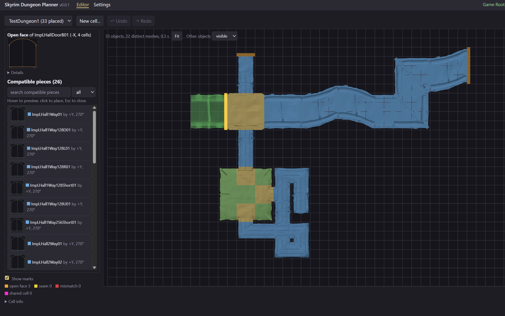

# Skyrim Dungeon Planner

2D top-down level design tool for assembling Skyrim SE dungeons from modular kits, running
entirely in the browser (Chrome or Edge, no backend). Your game folder is read in place through
the File System Access API; nothing is uploaded.

V1 covers the Imperial kit on a single Z level: open or create a plugin and its interior cells,
place tiles on the kit's grid, and let the assistant offer only the pieces that fit every
neighbour. Junctions are checked on the pieces' own mesh profiles (seams, mismatches, shared
cells), and the result is written back into the plugin, with a backup, for the Creation Kit.



## Documentation

- [User guide](docs/user-guide.md): getting started, the editor, the assistant, saving, limits.
- [Design documentation](docs/design/README.md)
  - [Architecture](docs/design/arch/README.md): structure, file formats, algorithms and
    concepts.
  - [Planning](docs/design/planning/README.md): decisions, risks, roadmap, V1 step plan.

## Limits of V1

- **Imperial kit only**: other kits (Nordic, Dwemer, caves) are not supported yet.
- **One level at a time**: ramps and stairs work, but the top-down view does not show heights.
- **Tiles only**: the tool places the kit's structural pieces; clutter, lights, markers and
  anything else in a cell are shown and left untouched, never edited.
- **No NavMesh, props, lighting or door links**: finish those in the Creation Kit (new cells get
  a neutral default lighting).
- **Seams are checked on the openings' outlines**: a gap elsewhere around a junction, or a
  texture that does not continue, is not detected.
- **Chrome or Edge only** (File System Access API), **ESL-flagged plugins are refused**, and a
  plugin must not be saved from the Creation Kit while it has unsaved edits in the tool.

See the [user guide](docs/user-guide.md#limits-of-v1) for details and the
[roadmap](docs/design/planning/04-roadmap.md) for what comes next.

## Use it

- **One file**: download `SkyrimDungeonPlanner.html` from the latest release (or from the
  _Single-file build_ workflow artifacts) and open it in Chrome or Edge.
- **Docker**: `docker run -p 8080:8080 ghcr.io/dickeyf/skyrimdungeonplanner:main`, then open
  <http://localhost:8080/>.
- **From source**: `npm install && npm run dev`.

Then follow _Getting started_: choose the game folder (and the Mod Organizer 2 instance if you
use one), pick or create the plugin to build in, and open the editor.

## Stack

TypeScript, Vite, Svelte 5 (runes), three.js, Vitest. Binary parsers (ESP / BSA / NIF), mesh
analysis and grid logic are framework-free under `src/lib`.

## Commands

```bash
npm install
npm run dev           # Vite dev server; proof-of-concept pages at /poc/<name>.html
npm test              # Vitest, single run
npm run check         # svelte-check + tsc
npm run lint          # ESLint
npm run format        # Prettier
npm run build         # production build to dist/
npm run build:single  # one self-contained dist-single/index.html
```

## Layout

```
docs/          user guide; design/arch (architecture), design/planning (decisions, plans)
data/          catalogue annotations (human decisions over the automatic analysis)
poc/           proof-of-concept HTML pages (phase 0)
tools/         Python + pynifly analysis scripts (prototypes)
docker/        nginx configuration of the image
src/lib/binary     BinaryReader / BinaryWriter
src/lib/format     esp/, bsa/, nif/ parsers and writers
src/lib/mesh       mesh analysis: openings, footprints, face profiles
src/lib/catalogue  catalogue: pieces, connection types, annotations
src/lib/grid       placements, editing, assistant, junction checks
src/lib/level      level store over the plugin: cells, edits, saving
src/lib/fs, vfs    File System Access API, Mod Organizer 2 virtual Data view
src/lib/render     three.js scene
src/pages          editor, settings, getting started
```

## License

GNU General Public License v3; see `LICENSE`.
