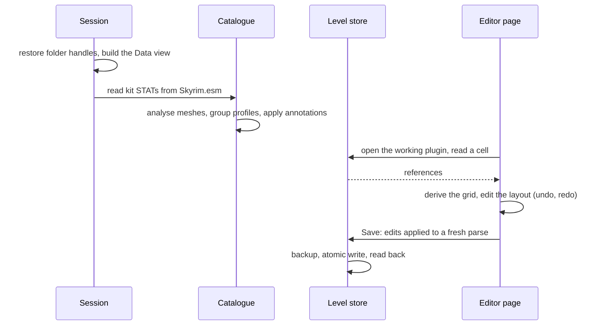

# 1. Structure

## Stack

TypeScript, Vite, Svelte 5 (runes, no SvelteKit), three.js, Vitest, ESLint, Prettier. The app is
a single-page application routed with the URL hash (`#/editor`, `#/settings/...`, `#/start`).

## Layers

```
src/lib/binary      BinaryReader / BinaryWriter (little-endian, growable)
src/lib/compress    LZ4 block and frame decompression
src/lib/format      esp/ (plugins), bsa/ (archives), nif/ (meshes)
src/lib/fs          File System Access API: paths, ranged reads, atomic writes,
                    IndexedDB handles and caches, localStorage preferences
src/lib/vfs         Mod Organizer 2 instance, virtual Data overlay, archive index
src/lib/mesh        mesh analysis: welding, openings, footprint, profiles, grouping
src/lib/catalogue   catalogue model, kit definitions, STAT extraction, analysis,
                    annotations, validation review
src/lib/grid        rotations, grid derivation, editing, assistant, junctions, overlaps
src/lib/level       level store over the plugin: cells, edits, saving, new plugins
src/lib/render      three.js scene, mesh cache, placement matrices
src/lib/session     app-wide Svelte state: folders and Data view, catalogue, annotations
src/lib/editor      editor state: working plugin, cells, loaded cell, save
src/components      Svelte components (cell view, profile drawing, settings blocks)
src/pages           Editor, Settings (+ sub-pages), Getting started
```

## Dependency rules

- `binary`, `compress`, `format`, `mesh`, `grid`, `catalogue` and `level` are pure TypeScript:
  no Svelte, no DOM beyond standard web APIs (`DecompressionStream`, `File`). They are
  unit-tested with Vitest in Node (`*.test.ts` next to the source), using tiny synthetic
  fixtures built in code: no game file is ever committed.
- File access goes through structural interfaces (`FsDir`, `FsFile` in `fs/paths.ts`) that the
  browser handles satisfy and that `fs/fakeFs.ts` implements in memory for tests.
- `render` is imperative three.js, outside Svelte; components drive it through a small API.
- `session`, `editor` and the Svelte files only wire pure logic to the UI; the rules
  (what fits, what is refused, what is written) live in `grid` and `level`.
- The grid module is per-kit data (`Kit.module`, D53): no code hard-codes 128.

## Identity: FormKeys

Records are addressed by **FormKey**, `0x00ABCDEF:Plugin.esp`: the object id (low 24 bits of a
FormID) and the file that defines it. FormIDs in a file carry a load-order index in their top
byte that only means something relative to that file's master list; converting at the edges
(`format/esp/formId.ts`) keeps the rest of the code load-order independent.

## Data flow



1. **Session** (`session/session.svelte.ts`): restores the game folder and MO2 instance handles
   from IndexedDB, then builds the **Data view** (`vfs`): the overlay of MO2 mod folders on the
   game's `Data`, the plugin load order and the archive load order.
2. **Catalogue** (`session/catalogueStore.svelte.ts`, `catalogue/*`): reads the kit's STAT
   records from `Skyrim.esm`, reads every piece's mesh, analyses it and groups face profiles
   into connection types; the committed annotations (`data/annotations/imperial.json`) are then
   applied (`applyAnnotations`) to give the final catalogue.
3. **Level** (`editor/editorStore.svelte.ts`, `level/*`): the working plugin is parsed into a
   level store; a cell's references are read and the grid view derived (`loadCell`).
4. **Editing** (`pages/EditorPage.svelte`, `grid/*`): the layout (tiles on the grid) is edited as
   immutable values with an undo history; the assistant and the junction checks read the layout.
5. **Saving** (`level/edits.ts`, `level/save.ts`): the layout's changes become level edits,
   applied to a fresh parse of the file, written with a backup.

## Persistence in the browser

| What | Where | Why |
| --- | --- | --- |
| Folder handles (game, MO2, project) | IndexedDB `handles` | handles are structured-cloneable, not JSON |
| Caches: kit STAT list, mesh analysis | IndexedDB `kv`, keyed by the master's size and date | the analysis takes about ten seconds |
| Preferences: MO2 profile, working plugin, last cell per plugin, display | localStorage `sdp.*` | small strings |
| Annotations | `data/annotations/imperial.json`, bundled at build time | human decisions, versioned with the code |

The analysis cache key includes `ANALYSIS_VERSION`, bumped whenever the analysis output changes
meaning, so stale results are never reused.
