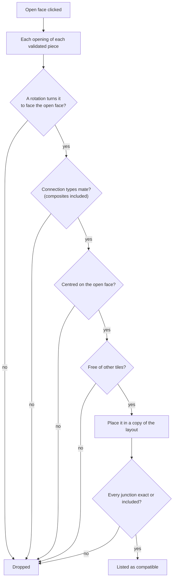
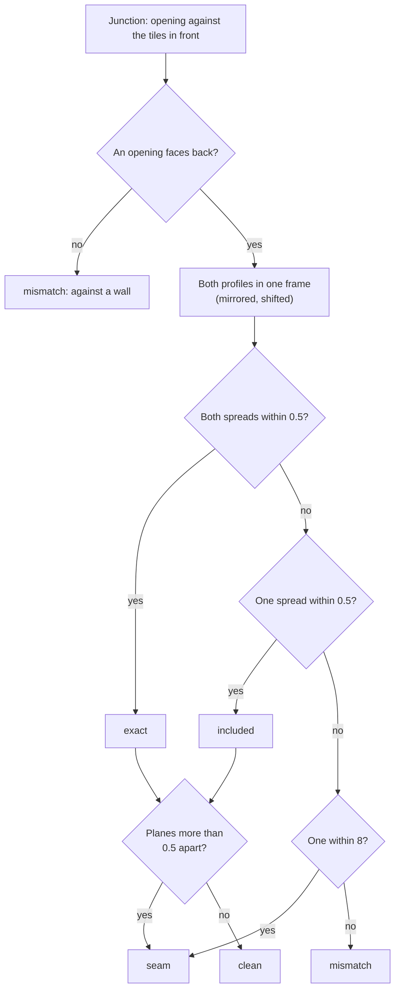

# 6. Assistant and junctions

The promise of the tool: **only offer what fits**. Everything here is pure logic in
`grid/assist.ts` and `grid/joints.ts`, computed from the layout and the catalogue.

## Openings and open faces

An **opening** is a contiguous run of a piece's faces with the same direction, type and plane
(the catalogue stores one face per cell). In the level, an opening is turned with its tile; its
**outside cells** are the cells just beyond it. An **open face** (orange) is an opening whose
outside cells are all free.

## Compatible pieces (`candidatesFor`, `checkCandidates`)

For an open face, every opening of every validated piece is tried:

1. **Rotation**: the one that turns the opening to face the open face (a direction fixes it).
2. **Type**: the two faces must mate (`facesMate`: one's type, or a composite `extraConn`,
   has the other as `mate`).
3. **Alignment**: the two openings are **centred** on each other (profiles are centred on their
   cells): same width, or a narrower opening inside a wider one through a composite. Odd width
   differences cannot be centred and are skipped. Levels are part of the cells, so a ramp is
   offered going up (by its low end) or down (turned, by its high end).
4. **Room**: no overlap with another tile (accepted overlaps excepted).
5. **Every neighbour**: the placement is simulated in a copy of the layout and **all** its
   junctions are judged, not only the clicked one. A placement is kept only if every junction
   is exact or included: a seam, a mismatch or an opening against a wall drops it.

## Junction verdicts (`joints.ts`, D60)

Connection types group profiles within a loose tolerance (8 units). A junction is judged again,
strictly, on the two profiles themselves:

1. **Same frame**: the facing opening's profile is redrawn in this opening's frame. Seen from
   the other side, it is mirrored (`u → −u`), then shifted by the offset between the centres of
   the two openings along the face, and by the difference of their levels.
2. **Distances**: for each profile, the distance from its samples to the other profile; the
   **spread** is the distance within which 97 % of the samples lie (robust to a few stray
   points).
3. **Verdict**:

   - **exact**: both spreads within `SEAM_TOL` (0.5 unit);
   - **included**: one profile lies within the other (one spread within `SEAM_TOL`): the extra
     geometry on one side (a ceiling detail, a wide door frame around a narrower hall) closes on
     nothing visible;
   - **seam** (yellow): they only coincide within the loose tolerance; the gap is shown;
   - **mismatch** (red): they do not coincide, or the opening faces a wall.
4. **Depth**: the opening planes may stand apart even when their shapes match; the gap between
   them is `insetA + insetB`. Over `DEPTH_TOL` (0.5 unit), an exact or included junction becomes
   a seam; a negative gap is an overlap that hides the joint.

The thresholds were measured on a real cell: seamless junctions give 0.0, a visible seam 1.0 (a
piece 1 unit off). When a profile is missing, the verdict falls back to the connection types.

**Cache**: a verdict depends only on the two pieces, their faces and their relative placement,
which repeat across a level; verdicts are cached by the two profiles, so rechecking all the
junctions of a 200-tile cell after an edit takes a few milliseconds instead of a second or two.
Each profile's segments and sample points are prepared once, and the second profile is not
redrawn in the first's frame: the sample points are moved instead (`profileFitInFrame`).

The editor also gives the geometry a **store that outlives it** (`JointGeometry.fits`, V4 step
11), saved in the browser with the analyses (`catalogueStore.profileFits`): a pair compared once
is read back after a reload. While the editor is idle, the open faces of the shown level are
worked out one by one (`requestIdleCallback`), so a click on one finds its verdicts ready. Why:
a first click compared hundreds of profile pairs (seconds in the browser); computing the
verdicts of every pair a kit allows, in advance, was set aside as far larger than what a
designer ever meets.

## Deep check (`leaks.ts`, R16, V2)

The profiles only see the open edges in the junction plane. The deep check looks at the render
meshes of the two sides, placed with their exact REFR positions:

1. **Exact**: the free borders (edges of a single triangle) of either side running along the
   junction plane, within 8 units of it, are sampled every unit; a sample farther than 0.5 unit
   from the other side is part of a candidate gap. An opening is judged against every tile
   facing it at once (`mergeWorldMeshes`): a border next to one tile may be closed by the next.
2. **Visible**: each candidate is looked at from six points where the player stands, on the axis
   of the passage, at 96, 192 and 320 units on each side, at eye height; the scene holds every
   tile around the junction, front faces grey, back faces red, void black. Red or black within
   two pixels of the gap is a visible leak; a view whose centre shows a back face is inside a
   wall and is dropped.

Kits hide many joints behind overlaps, so most exact candidates are not visible: the exact check
is only a filter. Proven on the known seam and on a 681-junction cell (step 5); the editor
integration came at step 6:

- `layoutJunctions` lists every opening facing tiles, with its frame and a **key**: the opening's
  piece and direction, then each facing piece with its position and quarter turn relative to the
  opening's piece (rounded to the unit). The same configuration anywhere, turned or not, shares
  one verdict.
- `editor/leakChecker.svelte.ts` checks the junctions of the loaded layout in the background, one
  at a time, and publishes verdicts as they come; they persist in IndexedDB (`leak:v1:<key>`,
  derived from the game files, never committed). A new layout cancels the run; known keys apply
  at once. The views use `render/leakViews.ts` (one off-screen renderer) and the welded meshes
  of `MeshCache.welded`.
- A leak is a violet mark; the junction panel gives its width, position and the standing points
  that see it. `checkCandidates` takes an `accept` hook: the assistant drops a placement whose
  junction has a known leak (only once checked: an unchecked pair is offered).

## Texture continuity (`textures.ts`, V2, optional)

The triangle edges of both sides lying on the junction plane (triangles lying in the plane
excluded), within the opening's width and grid level, are paired where they run along each
other; along each pair, the texture file must be the same and the texture coordinates must
differ by the same whole number of repeats at both ends and in the middle (0.02 of a repeat
tolerated). Otherwise the break's cause is `texture` (another file) or `offset` (a shift,
a flip). Breaks shorter than 4 units are ignored. Higher than the opening's level, the outer
shells of the pieces meet on the plane too and never match: they are left out.

`editor/textureChecker.svelte.ts` keeps verdicts in memory by junction key (the check is cheap
once the meshes are read, `MeshCache.merged`). With the option on, the editor marks breaks in
cyan and ranks the assistant's placements: continuous first, not checked yet, then breaks.

## The game's pairs (`catalogue/vanillaPairs.ts`, V4 step 9b)

The Vanilla check (`level/vanillaCheck.ts`) reads the master's CELLs built with a kit and lists
every pair of tiles meeting at an opening (`meetingPairs`) with its relative placement
(`relativePlacement`, as for accepted overlaps) and a count. The pairs used at least twice are
committed per kit in `data/vanilla/<kit>.json` and passed to the verdicts as
`JointGeometry.vanilla`: a junction whose tiles in front all stand in such a placement is taken
as exact, and its texture breaks are not shown. Why: the profile and texture checks flag pairs
the game uses everywhere, which a designer new to a kit cannot tell from real faults.

## Marks

| Mark | Meaning | Source |
| --- | --- | --- |
| orange | open face: click for compatible pieces | `openFaces` |
| yellow | seam, with its gap in units | `badJoints` |
| red | mismatch, or an opening against a wall | `badJoints` |
| violet | visible leak found by the deep check | `leakChecker` |
| cyan | texture break (optional check) | `textureChecker` |
| magenta | cell shared by two tiles (not an accepted overlap) | `sharedCells` |

A selected tile lists all its junctions (`jointsOfTile`) with their verdict, both distances and
the depth gap, and draws the two profiles overlaid.

## Snapping (`snapPlacement`)

Pieces do not all span whole multiples of an opening, so the plain grid may leave a piece one
cell off the face it should join. While placing a piece (from the palette, or dragging an
existing tile, which is then taken out of the layout for the computation), the open faces within
`SNAP_RANGE` (2 modules) of the pointer are tried: the placements of **that** piece that fit the
face and every neighbour are scored by the distance from their footprint centre to the pointer,
plus one module when the rotation differs from the chosen one. The best one wins; with none, the
plain grid applies.
