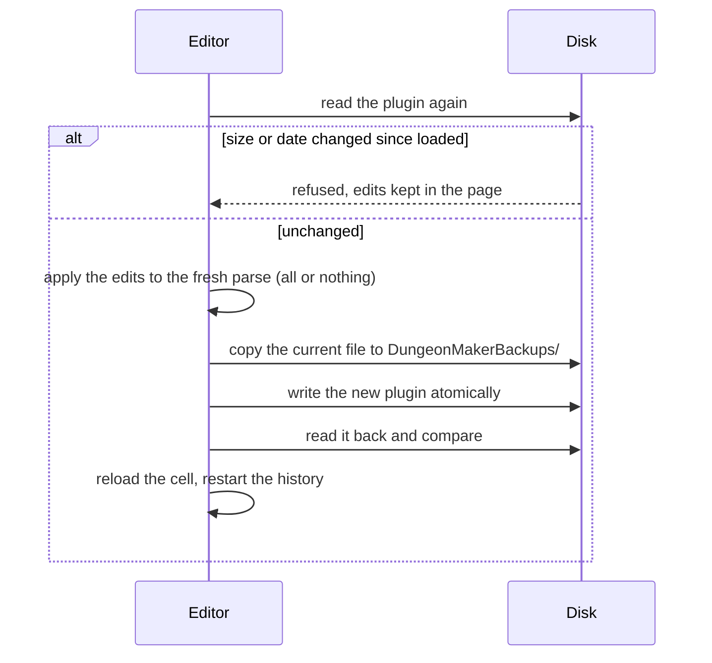

# 7. Writing plugins

The plugin is the source of truth (D10): the tool keeps no level document of its own. Edits are
held in memory as a layout until the user saves; saving writes the plugin in place.

## Level store (`level/store.ts`, D57)

The editor talks to a format-independent **level store**: list cells, read a cell's references,
apply edits, add a cell, serialize. Everything is addressed by FormKey. The `.esp` backend
(`espStore.ts`) wraps the plugin tree of [File formats](02-file-formats.md); a Spriggit
(YAML/JSON) backend can be added later without touching the editor (phase 6).

## From layout to edits (`level/edits.ts`)

`changes()` of the layout become level edits: **remove** by reference FormKey, **move** with the
grid placement of the moved tile, **add** with the piece's base FormKey and its grid placement
(`tileWorldPlacement`: `pos = corner + R·pivot`, heading from the quarter turns).

`applyEdits` is **all or nothing**: every edit is checked first (the reference exists in the
cell, it belongs to the plugin itself, the base's plugin is one of its masters); only then are
they applied, so a refused edit leaves the plugin untouched.

## Safe saving (`level/save.ts`, V5, D47)

1. **Stamp**: the file's size and modification time are recorded when it is loaded.
2. The file is **read again**; if its stamp changed (the Creation Kit saved it meanwhile), the
   save is refused and the edits stay in the page: nothing written elsewhere is overwritten.
3. The edits are applied to that fresh parse.
4. **Backup**: the current file is copied to `DungeonMakerBackups/<name>.<YYYYMMDD-HHMMSS>.esp.bak`
   next to it; the `.bak` extension keeps the game and the CK from loading it.
5. The plugin is replaced **atomically** and **read back** byte for byte.
6. The cell is reloaded from the file, and the edit history restarts from it.

ESL-flagged plugins are refused (V6): their FormID range is restricted.

## New plugins and cells (`format/esp/create.ts`, D62)

- **New plugin**: a bare `TES4` header: `HEDR` version 1.71 (the SE Creation Kit's), record
  count 0, first object id `0x800` (the CK's), author, and masters: `Skyrim.esm` plus every
  plugin providing a catalogue piece, official masters first then in load order
  (`level/masters.ts`). It is created in an enabled mod folder of the Data view, or in a new MO2
  mod folder to enable in MO2; an existing file is never overwritten.
- **New interior cell**: a `CELL` record with `EDID`, `DATA` = interior flag and a default
  lighting `XCLL` (92 bytes in SE: dim neutral ambient, no directional light, no fog); the real
  lighting is set in the CK. It goes into its **block and sub-block**, the last and
  second-to-last decimal digits of its object id, creating the groups as needed. When the plugin
  has no `CELL` top group yet, one is inserted before the top groups that follow `CELL` in the
  game's order (`WRLD`, `DIAL`, `QUST`...). The cell is written at once, with the same checks and
  backup as a save.

## NavMesh records (`navmesh/build.ts`, `Plugin.addNavm`, V2)

`buildNavMesh(cell, vertices, triangles)` turns a triangle mesh into the `NVNM` data of an
interior NavMesh, following what the Creation Kit writes (measured on the 1,526 interior
NavMeshes of Skyrim.esm):

- triangles are counter-clockwise seen from above; edge k runs from vertex k to vertex k + 1 and
  holds the neighbour triangle across it, or -1 (a non-manifold edge is refused);
- every triangle gets flag `0x0800`, as nearly all vanilla triangles;
- the search grid spans the bounding box of the vertices the triangles use, `divisor` cells per
  side, numbered row by row along Y; each cell lists the triangles touching it (separating-axis
  test, touching counts). The divisor is 1 up to 16 triangles, 2 below 50, then one more per 50
  triangles, at most 12 (exact on all 1,526 meshes; cell contents match on two thirds of them,
  the rest differ on border cases, harmless for a search grid).

Edge links, door links and cover are left empty: the CK's Finalize adds door links and cover and
writes the `NAVI` record, and keeps a generated NAVM otherwise unchanged (R1, V2 step 3).
`Plugin.addNavm` adds the record to the cell's temporary children, like a reference, with a new
FormID. One NAVM per cell (D36).
