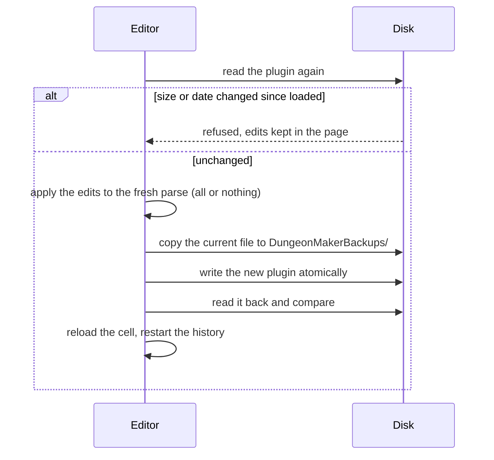

# 7. Writing plugins

The plugin is the source of truth (D10): the tool keeps no level document of its own. Edits are
held in memory as a layout until the user saves; saving writes the plugin in place.

## Level store (`level/store.ts`, D57)

The editor talks to a format-independent **level store**: list cells, read a cell's references,
apply edits, add a cell, serialize. Everything is addressed by FormKey. The `.esp` backend
(`espStore.ts`) wraps the plugin tree of [File formats](02-file-formats.md); a Spriggit
(YAML/JSON) backend can be added later without touching the editor (phase 6).

## From layout to edits (`level/edits.ts`)

`changes()` of the layout become level edits: **remove** by reference FormKey, **move** with the
grid placement of the moved tile, **add** with the piece's base FormKey and its grid placement
(`tileWorldPlacement`: `pos = corner + R·pivot`, heading from the quarter turns).

`applyEdits` is **all or nothing**: every edit is checked first (the reference exists in the
cell, it belongs to the plugin itself, the base's plugin is one of its masters); only then are
they applied, so a refused edit leaves the plugin untouched.

## Safe saving (`level/save.ts`, V5, D47)

1. **Stamp**: the file's size and modification time are recorded when it is loaded.
2. The file is **read again**; if its stamp changed (the Creation Kit saved it meanwhile), the
   save is refused and the edits stay in the page: nothing written elsewhere is overwritten.
3. The edits are applied to that fresh parse.
4. **Backup**: the current file is copied to `DungeonMakerBackups/<name>.<YYYYMMDD-HHMMSS>.esp.bak`
   next to it; the `.bak` extension keeps the game and the CK from loading it.
5. The plugin is replaced **atomically** and **read back** byte for byte.
6. The cell is reloaded from the file, and the edit history restarts from it.

ESL-flagged plugins are refused (V6): their FormID range is restricted.

## New plugins and cells (`format/esp/create.ts`, D62)

- **New plugin**: a bare `TES4` header: `HEDR` version 1.71 (the SE Creation Kit's), record
  count 0, first object id `0x800` (the CK's), author, and masters: `Skyrim.esm` plus every
  plugin providing a catalogue piece, official masters first then in load order
  (`level/masters.ts`). It is created in an enabled mod folder of the Data view, or in a new MO2
  mod folder to enable in MO2; an existing file is never overwritten.
- **New interior cell**: a `CELL` record with `EDID`, `DATA` = interior flag and a default
  lighting `XCLL` (92 bytes in SE: dim neutral ambient, no directional light, no fog); the real
  lighting is set in the CK. It goes into its **block and sub-block**, the last and
  second-to-last decimal digits of its object id, creating the groups as needed. When the plugin
  has no `CELL` top group yet, one is inserted before the top groups that follow `CELL` in the
  game's order (`WRLD`, `DIAL`, `QUST`...). The cell is written at once, with the same checks and
  backup as a save.

## Walkable polygons (`navmesh/walkable.ts`, V2)

`walkablePolygons(collision, options, tileFrame(piece, module))` gives the walkable area of a
tile as rings in piece space (outer counter-clockwise, holes clockwise), each vertex at the floor
height:

1. the collision is sampled every `step` units over the tile's footprint: upward faces (slope
   within `maxSlope`, or steeper but no taller than a step) are floor candidates, downward faces
   ceilings, near-vertical faces walls occupying their height band;
2. a candidate is valid with `actorHeight` free above it (obstacles below `stepHeight` are
   stepped over) and a ceiling above (not a wall top or a roof);
3. floors grow from the openings (the piece's open faces, at their level): each sample takes the
   valid floor closest to its neighbour's within a step, so a staircase is followed and a floor
   enclosed under it or a cavity in a wall stays out;
4. jumps above a step form ledges; the area is eroded by `actorRadius` from obstacles, voids and
   ledges but not from the footprint edge, where the neighbour's floor continues;
5. the outline is traced along the samples, snapped to the footprint edge and simplified
   (Douglas-Peucker, `tolerance`).

Defaults, tuned on the Imperial tiles: step 4, radius 16, height 96, step height 64 (the stairs'
step blocks rise 52 above their ramp), slope 50 degrees, tolerance 6.

## Bake (`navmesh/bake.ts`, V2)

`bake(tiles, options, grid)` turns the walkable polygons of placed tiles into one triangle mesh:

1. each tile's rings are placed in the world (its exact REFR placement) and triangulated on their
   own, which gives the height of any point;
2. every tile polygon is cut along the grid cells (`polygon-clipping`, coordinates snapped to
   1/32 of a unit, on which its sweep line otherwise fails), each piece simplified in 3D (a
   change of slope stays);
   the parts different tiles leave in one cell are merged (tiles may overlap: a nested piece, a
   door's floor patch reaching into the neighbour), or their triangles would stack;
3. every piece edge gets the vertices of the neighbouring pieces lying on it, so both sides of a
   cell line or a tile border carry the same vertices; a narrower opening leaves the rest of the
   wider border as a border (R11);
4. each piece is triangulated (`earcut`), vertices within half a unit welded; the flat triangles
   ear clipping leaves along collinear border points are removed, the triangle across split at
   the middle point where that mends a crack; then each cell is made Delaunay by edge flips
   (Lawson; outlines and cell lines stay).

A full cell is two triangles; only the cells along the walls hold small polygons, whose fans
stay inside the cell. One triangulation per tile (long fans along the walls) and one union of the
whole selection (slivers across rooms) were tried first. The editor previews the result
(`CellScene.setNavMesh`); writing it is the next step.

## Several levels (`navmesh/levels.ts`, V3, R7)

The bake works in plan, so stacked floors are baked apart: `bakeLevels` groups the tiles by
their lowest level (a staircase goes with the floor it starts from), bakes each group with the
existing triangles of its heights left out (within half a grid level), and the editor welds the
results onto the NavMesh one after the other with `mergeNavMesh`; the top of a staircase welds
to the floor above like any border.

## NavMesh records (`navmesh/build.ts`, `Plugin.addNavm`, V2)

`buildNavMesh(cell, vertices, triangles)` turns a triangle mesh into the `NVNM` data of an
interior NavMesh, following what the Creation Kit writes (measured on the 1,526 interior
NavMeshes of Skyrim.esm):

- triangles are counter-clockwise seen from above; edge k runs from vertex k to vertex k + 1 and
  holds the neighbour triangle across it, or -1 (a non-manifold edge is refused);
- every triangle gets flag `0x0800`, as nearly all vanilla triangles;
- the search grid spans the bounding box of the vertices the triangles use, `divisor` cells per
  side, numbered row by row along Y; each cell lists the triangles touching it (separating-axis
  test, touching counts). The divisor is 1 up to 16 triangles, 2 below 50, then one more per 50
  triangles, at most 12 (exact on all 1,526 meshes; cell contents match on two thirds of them,
  the rest differ on border cases, harmless for a search grid).

Edge links, door links and cover are left empty: Finalize (the CK's, or the tool's, below) adds
door links and writes the `NAVI` record, and keeps a generated NAVM otherwise unchanged (R1, V2
step 3).
`Plugin.addNavm` adds the record to the cell's temporary children, like a reference, with a new
FormID; `Plugin.setNavm` replaces an own NAVM's `NVNM` field, keeping the others (a compressed
record is written back uncompressed); `Plugin.cellNavms` lists a cell's NAVMs. The level store
exposes them as `readNavMeshes` and the `navmesh` edit.

## Finalize (`navmesh/finalize.ts`, `format/esp/navi.ts`, V2 step 16)

What the CK's Finalize writes, measured on Skyrim.esm and on a plugin it finalized:

- **Door links**: a load door (a reference with XTEL) is linked to the triangle containing its
  arrival marker, seen from above; the marker is the position stored in the XTEL of the door
  leading to it. The triangle gets flag `0x400`, the NAVM a door link (triangle, CRC
  `0xE48B73F3` "PathingDoor", door), the door an `XNDP` (NAVM, triangle, 2 unused bytes).
  `finalizeCell` falls back on the nearest triangle centre within 128 units, and rebuilds the
  door links from scratch.
- **NAVI** (one record, the master's `0x00012FB4`, overridden by a plugin): `NVER`, one `NVMI`
  per NavMesh, `NVPP` (precomputed paths, copied unchanged from the master) and `NVSI`. An NVMI
  holds the NavMesh, flags (`0x20` island, `0x40` not edited), its vertices' mean, a preferred
  share, the NavMeshes it links to, preferred links, doors (CRC, door), island data (bounds,
  triangles, vertices) and the pathing cell (CRC `0xA5E9A03C`, then the cell or the worldspace
  grid). A NavMesh the cell's largest one cannot reach through edge links is an island.
- `EspLevelStore.finalize` writes the cell's NAVMs, the XNDP of its own doors and the NAVI
  override: entries of other cells kept, the cell's replaced; a plugin without NAVI starts from
  the master's (`MasterNavi`, read by the editor from the first master that has one).
  `Plugin.setNavi` places a new NAVI top group just before CELL (xEdit's group order).

## Editing a NavMesh (`navmesh/pick.ts`, V2)

Seen from above: `pickElement` finds the triangle containing a point, or the edge (named `u:v`,
u < v) or vertex nearest to it within a tolerance; `elementsInBox` takes triangles by their
centre, edges by their middle, and vertices; `trianglesOfSelection` gives the triangles a
deletion removes (those using a selected edge or vertex), which `removeTriangles` then drops.

Hand edits (`navmesh/edit.ts`): `mergeVertices` moves the first vertex to the mean and maps
the others onto it, removing collapsed triangles; `addTriangle` winds three vertices
counter-clockwise. `joinNavMeshes` appends one NAVM to another (vertex, triangle, edge link,
door link and cover indices shifted); edge links between the two are dropped, and
`retargetLinks` points the cell's other NAVMs at the joined one. Each edit ends with `relink`:
neighbours recomputed (an edge link welded to a neighbour becomes a plain edge) and the search
grid rebuilt; a flipped or flat triangle, or an edge shared by three triangles, throws.

## Adding a bake to a cell's NavMesh (`navmesh/stitch.ts`, D35, D36, D64)

- **Covered tiles** (D35): a tile has NavMesh when a triangle's centre falls in one of its cells,
  at that cell's level. A bake skips them (D64), over every NAVM of the cell.
- **No overlap**: the bake leaves out the area the existing triangles cover (each cell's pieces
  minus the triangles over that cell, `polygon-clipping`).
- **Target**: the own NAVM sharing the most vertices with the bake, else the largest own one,
  else a new one. A CK cell may hold several NAVMs; the others are left untouched.
- **Merge** (`mergeNavMesh`): the bake's vertices weld onto the target's (half a unit, a step in
  height), its triangles are appended; `conformMesh` then splits the border edges of either side
  at the other side's border vertices lying on them (an existing triangle keeps its index, its
  new half goes to the end, with the same flags), so the borders share their vertices. A
  triangle with a link to another NavMesh is never split. The existing triangles keep their
  flags, cover flags and edge links; door links and cover keep their indices; adjacency and the
  search grid are recomputed.
- **Removing** (`trianglesInTiles`, `removeTriangles`, for Replace and Clear): the triangles
  whose centre falls in the selected tiles' cells go; the others are renumbered, their
  neighbours across the removed ones become borders, door links and cover follow, unused
  vertices are dropped. A NAVM left without triangles is deleted (`Plugin.deleteNavm`, a
  `navmesh` edit with a null NavMesh).
- **Unlinked borders**: new border edges longer than 8 units (the steps at wall corners are no
  gap) and within 32 units of any NavMesh of the cell but not
  welded (along another NAVM, or too far) are returned and drawn in red, to link in the CK.
