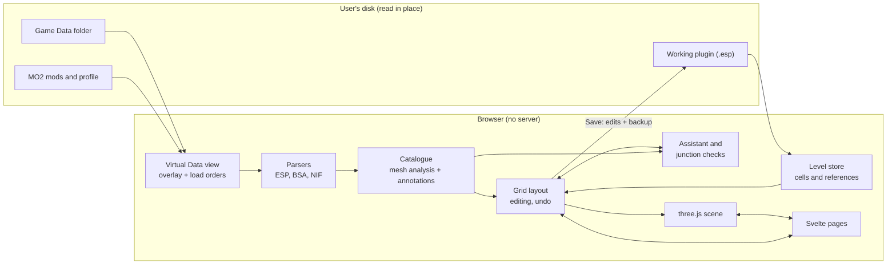

# Architecture

Technical documentation of Skyrim Dungeon Planner: how the application is built, the file formats
it reads and writes, and the algorithms behind the catalogue, the grid, the assistant and the
junction checks. The design decisions (`Dnn`), open questions (`Vnn`) and risks (`Rnn`) quoted
here are in [../planning/](../planning/README.md).

1. [Structure](01-structure.md): layers, modules, dependency rules, data flow, persistence.
2. [File formats](02-file-formats.md): plugins (ESP), archives (BSA, LZ4), meshes (NIF).
3. [Game data access](03-game-data.md): File System Access API, Mod Organizer 2 virtual Data
   view, archive load order.
4. [Catalogue](04-catalogue.md): mesh analysis (openings, footprint, face profiles), connection
   types, human annotations.
5. [Grid and editing](05-grid-and-editing.md): grid derivation from a cell, rotations, layouts,
   editing rules, history, accepted overlaps.
6. [Assistant and junctions](06-assistant-and-junctions.md): open faces, compatible pieces,
   junction verdicts, snapping.
7. [Writing plugins](07-writing-plugins.md): level store, edits, safe saving, new plugins and
   cells.
8. [Rendering and UI](08-rendering-and-ui.md): three.js scene, Svelte state, pages.
9. [Build and CI](09-build-and-ci.md): builds, Docker image, GitHub Actions.

## In one picture

Everything runs in the browser (Chrome or Edge): there is no server, nothing is uploaded, and
the plugin (`.esp`) stays the only source of truth for the level (D10).
