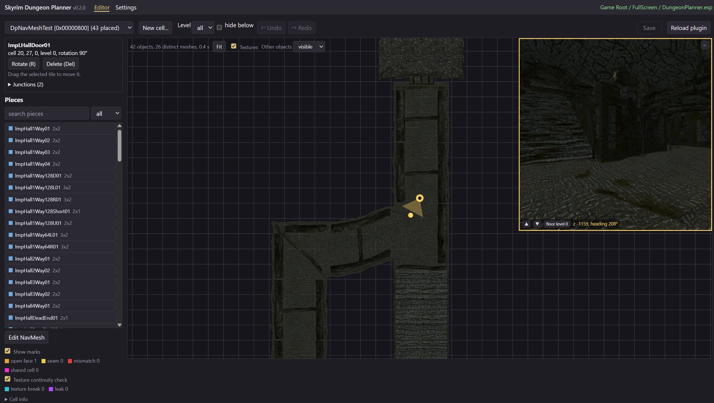

# User guide

Skyrim Dungeon Planner builds Skyrim SE dungeons from the Imperial kit on a top-down grid and
writes them into your plugin, ready for the Creation Kit. It runs entirely in your browser:
your game folder is read in place and nothing is uploaded.

## Contents

1. [Requirements](#requirements)
2. [Getting started](#getting-started)
3. [The editor](#the-editor)
4. [Building with the assistant](#building-with-the-assistant)
5. [Placing and moving pieces](#placing-and-moving-pieces)
6. [Marks: open faces, seams, mismatches, leaks, shared cells](#marks)
7. [NavMesh](#navmesh)
8. [Saving and the Creation Kit](#saving-and-the-creation-kit)
9. [New plugins and cells](#new-plugins-and-cells)
10. [Settings](#settings)
11. [Limits](#limits)
12. [Troubleshooting](#troubleshooting)

## Requirements

- **Chrome or Edge** (desktop). The tool needs the File System Access API, which other browsers
  do not offer.
- **Skyrim Special Edition** installed, with its `Data` folder.
- Optional: **Mod Organizer 2**. The tool then sees the game exactly as your MO2 profile does,
  mods included.

Open the app in one of three ways: the single `SkyrimDungeonPlanner.html` file (double-click it),
the Docker image (<http://localhost:8080/>), or from source (`npm run dev`).

## Getting started

The first time, the app opens **Getting started**, three steps that check themselves off:

1. **Your game**: choose the Skyrim SE folder (the game folder or its `Data` folder). If you use
   MO2, also choose its instance folder (the one with `ModOrganizer.ini`) and your profile. The
   browser asks for permission to read and write these folders; it keeps it for the next visits
   (after a browser restart, it may ask again: click _Re-authorize_).
2. **Your plugin**: pick the plugin to build in, or create a new one (see
   [New plugins and cells](#new-plugins-and-cells)).
3. **Build**: open the editor. The first time, the tool analyses the kit's pieces from your
   game files (about ten seconds); the result is kept for the next times.

Once set up, the app opens the editor directly.

## The editor

- **Toolbar**: the cell of the plugin (choosing one opens it; the last cell you opened in each
  plugin reopens automatically), _New cell..._, _Undo_ / _Redo_, **Save** (with the number of
  unsaved changes; hover it for the details), _Reload plugin_.
- **Scene**: the cell seen from above, on the kit's grid. Drag to pan, use the wheel to zoom,
  _Fit_ to frame the whole cell. Pieces are coloured by category: halls, rooms, doors. _Other
  objects_ (lights, clutter, markers, pieces outside the kit) can be shown, faded or hidden:
  they are never changed.
- **Left panel**: what you are doing (placing a piece, an open face and its compatible pieces,
  the selected tile), then the **Pieces** palette with a search box and a category filter, then
  the legend of the marks.

Keyboard: **R** / **Shift+R** rotate, **Del** delete, **Esc** cancel, **Ctrl+Z** / **Ctrl+Y**
undo / redo, **Ctrl+S** save. _Shortcuts_ in the left panel lists them.

## Building with the assistant

Every opening of a piece that leads nowhere is marked with an **orange** strip: an _open face_.
Click it, and the left panel lists the **compatible pieces**: only placements that fit this face
**and** every piece they would touch, without seams. Each one shows the drawing of its opening.
Hover a line to preview the piece in place, click to place it. Use the search box and the
category filter above the list to narrow it down; _Esc_ closes it.

Ramps and stairs are offered both ways: going up by their low end, or down by their high end.

## Placing and moving pieces

- **From the palette**: click a piece, then click in the scene to place it; you keep placing the
  same piece (Shift+click places it and stops). **R** / **Shift+R** turn it. Near an orange face
  it fits, the piece **snaps** onto it, aligned with the opening and turned if needed; far from
  any, it follows the grid.
- **Select** a tile by clicking it: the panel shows its cell, rotation and **junctions**. Your
  own tiles can be turned (**R**), deleted (**Del**) or **dragged** to move them; a dragged tile
  snaps onto open faces too. Tiles that belong to a master file are read-only.
- **Select several tiles**: **Shift+click** adds or removes a tile, **Shift+drag** draws a
  rectangle that adds every tile it touches, **Ctrl+A** selects all, **Esc** clears. Drag one of
  them to move the whole group (green where it fits, red on a conflict); **Del** deletes them.
  A group move or deletion is undone in one step. Only a single tile turns.
- A placement that would share a cell with another tile is refused (the preview turns red).
- Everything can be undone and redone until you save.

## Marks

| Mark | Meaning | What to do |
| --- | --- | --- |
| orange | open face | click it to add a piece that fits |
| yellow | **seam**: the openings match only roughly; the gap is shown (1 unit already shows up close) | replace one of the pieces, or check it in game |
| red | **mismatch**: the openings do not match, or an opening faces a wall | replace or move a piece |
| violet | **leak**: a gap you can see from where the player stands (void or the back of a wall), found by the deep check | replace one of the pieces |
| cyan | **texture break** (optional check): the texture does not run on across the junction | turn or replace one of the pieces |
| magenta | **shared cell**: two tiles overlap | if it is intended and shows no seam, mark it (below) |

Click a mark to see the details. For a junction, the panel draws both openings overlaid (red:
this piece, green: the neighbour, as seen from this side) with the measured gaps.

**Intended overlaps**: some pieces are made to nest into their neighbour to hide the joint. Click
the magenta cell and _Mark ... as intended_: that pair, in that exact placement, is then accepted
everywhere, not flagged, and may be placed and offered. The decision is stored with the
catalogue annotations (_Settings_, _Validation_, _Accepted overlaps_, where it can be removed).

**Deep check**: besides the outlines of the openings, every junction is checked in the background for gaps anywhere around it (a door frame or a floor that stops short), then looked at from where the player stands: only a gap you could see is a leak. The legend shows the progress (_checking x/y_). A verdict depends only on the pieces and their relative placement, so it is kept in the browser and reused everywhere; the first check of a cell takes a few seconds, the next ones are instant. The assistant stops offering a placement once it is known to leak, and says which pieces it set aside. Click a leak to open the free face next to it and see the pieces that plug it. The panel of a junction gives the leak's size and position.

**Texture continuity check** (legend, off by default): marks in cyan the junctions where the texture does not run on (another texture, or the same one shifted, as a room piece turned the wrong way round), explains the break in the junction panel, and makes the assistant list the placements that keep the texture continuous first, the others marked _texture break_.

_Show marks_ turns all marks off and on.

## NavMesh

The tool bakes the NavMesh of your tiles from their walkable floor (computed from each piece's
collision): two triangles per grid cell where the floor is open, small polygons along the walls.

Every NavMesh tool is in **Edit NavMesh** mode, where the selection is the NavMesh instead of
the tiles (the piece list is hidden):

- The list shows the cell's NavMesh records; the active one is orange. Click one, or click its
  triangles in the view, to make it active. **Wipe** empties a record.
- Select **triangles**, **edges** or **vertices**: click, Shift+click to add or remove,
  Shift+drag a rectangle. **Del** deletes the selected triangles, or those using a selected edge
  or vertex. Ctrl+Z / Ctrl+Y undo and redo; **Write NavMesh** (Ctrl+S) saves them, with
  a backup.
- With **vertices**, the selection may span the cell's NavMesh records. **Merge vertices** (M)
  merges the selected vertices into one, at their mean: use it to weld a red border, two vertices
  at a time. **Create triangle** (T) adds a triangle on three selected vertices. When the
  vertices belong to two records, the smaller record is first joined into the larger one: the
  cell keeps a single NavMesh there.
- A Shift+drag rectangle on floor without NavMesh draws a white **region** for Bake.

- **Fill** bakes every tile no NavMesh covers yet.
- **Bake** (the region, the selected triangles' tiles, or the whole cell) bakes the tiles that
  have no NavMesh yet; tiles that already have triangles, whoever made them (you in the Creation Kit, or the
  tool), are never touched. The new triangles are welded onto the NavMesh already there.
- **Replace** deletes the NavMesh of the selected triangles' tiles (or the region's) and bakes them anew; **Clear** only
  deletes it.
- **Locked**: once you finish a cell's NavMesh by hand, lock it: Replace and Clear are then
  disabled for that cell.

Each tool first shows a **preview** (the cell's NavMesh as it would be, and a summary).
**Apply** keeps it as an edit, undoable like the others; nothing is written until **Write
NavMesh**, which makes a backup first. Red marks are new borders next to a NavMesh that could
not be welded to it (along another NavMesh record of the cell, for instance): merge their
vertices or add triangles. Floor patches apart from the rest and smaller than a grid cell (the
top of a plinth) are left out of a bake.

**Finalize** (once the NavMesh is written) links the cell's load doors to the NavMesh and
updates the plugin's `NAVI` record, as the Creation Kit's Finalize does: an NPC can then follow
you through a door. Cover is not computed, and a door of a master plugin (an exterior door, for
instance) is left to the Creation Kit's Finalize. Do not keep the plugin open in the Creation
Kit while the tool writes it: reload it there afterwards.

Cell EditorIDs are not case sensitive and must be unique across the masters too: Skyrim.esm
already has cells such as `NavmeshTest`; the Creation Kit renames a duplicate
(`...DUPLICATE003`). **New cell** refuses such a name (the masters are read once, a few
seconds for Skyrim.esm). Prefix your EditorIDs with your mod's own prefix.

## Saving and the Creation Kit

Edits stay in the page until you click **Save** (or press Ctrl+S). Saving:

1. refuses to write if the plugin changed on disk since it was opened (for example, saved by the
   Creation Kit): click _Reload plugin_ first (your unsaved edits would be lost, so save them
   before working in the CK);
2. makes a **backup** of the current file in `DungeonMakerBackups/` next to the plugin, named with
   the date and time (`MyDungeon.20260924-140509.esp.bak`); the game and the CK ignore it;
3. writes the plugin, then reads it back to check it.

Existing references keep their FormIDs; only their position and angle change. New tiles get new
FormIDs of your plugin.

**With the Creation Kit**: do not save the plugin from the CK while it has unsaved edits here,
and after saving here, reload the plugin in the CK before editing it there. The lighting,
navmesh, doors' teleport links and everything else remain the CK's job.

## New plugins and cells

- **New plugin** (_Settings_, _Folders and plugin_, or Getting started): type the file name
  (it follows the folder name until you change it) and choose the folder: an enabled mod
  folder, or _New MO2 mod folder..._. The plugin is empty, with `Skyrim.esm` (and any master
  the kit's pieces need) as masters. For a new MO2 mod folder: in MO2, refresh (F5), enable the
  mod and the plugin, then click _Reload MO2 profile_. Enable the plugin in your mod manager so
  the game and the CK load it.
- **New cell** (editor toolbar): type an EditorID (letters, digits, `_`). The interior cell is
  created with a neutral default lighting and written at once (with a backup); set its real
  lighting in the CK.

## Settings

- **Folders and plugin**: game folder, MO2 instance and profile, working plugin, new plugin.
- **Catalogue**: the kit's pieces extracted from `Skyrim.esm` and their analysis.
- **Validation**: review of the automatic connection types (near matches, composite faces,
  pieces, accepted overlaps). The decisions are catalogue annotations.

## Limits

- The **Imperial kit** only, and **one level (Z)** at a time: ramps and stairs work, but the view
  does not show heights, so take care where levels change.
- The tool edits tiles only (the kit's structural pieces); everything else in a cell passes
  through untouched.
- No props or lighting. The NavMesh is baked, edited and finalized in the tool, but without
  cover, and the side of a door that belongs to a master (an exterior door) is finalized in the
  Creation Kit.
- Texture continuity is checked near the floor (the opening's level) only.
- ESL-flagged plugins are not supported.

## Troubleshooting

- **"Opening the game folder..." stays, or a permission message shows**: open _Settings_ (or
  Getting started) and click _Re-authorize_; the browser needs a click to give access back.
- **Save refused, "changed on disk"**: the plugin was saved elsewhere (the CK). Click _Reload
  plugin_.
- **A new plugin does not appear**: in a new MO2 mod folder, enable the mod in MO2, then _Reload
  MO2 profile_.
- **Restore a backup**: copy the wanted `.esp.bak` from `DungeonMakerBackups/` over the plugin
  and remove the `.bak` extension.
